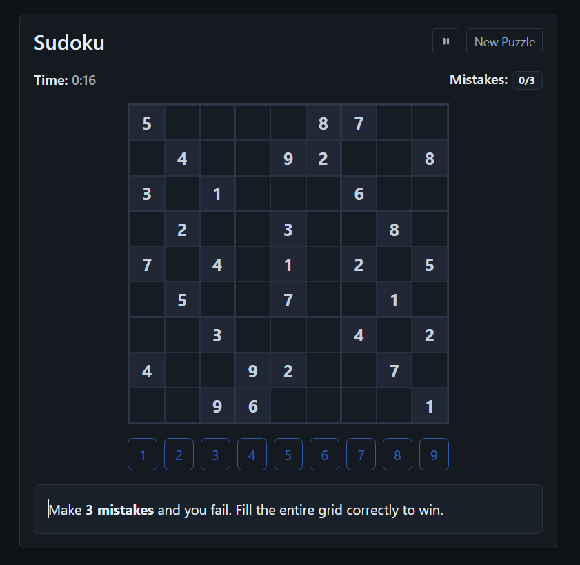

# Sudoku (React)



A fast, client side Sudoku built with React and Vite. Generates puzzles (easy/medium/hard) via backtracking, enforces unique solutions, tracks time, and counts mistakes.

## Features
- Difficulty: Easy / Medium / Hard (controls number of prefilled tiles)
- Start screen + timer
- Mistake counter (fail at 3)
- Keyboard & mouse input
- Accessible focus states and dark theme
- Responsive layout with React-Bootstrap

## Tech Stack
- React + Vite
- React-Bootstrap & Bootstrap Icons

## Getting Started
```bash
npm install
npm run dev
